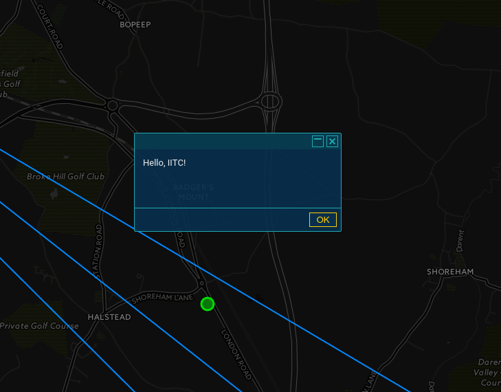

The Plugin API
==============

IITC has a plugin API that can be used by other userscripts to register as
plugins. It also imports `jQuery UI <https://jqueryui.com/>`_ to serve as a
widget toolkit, however the widgets are styled to match IITC's look.

Plugin lifecycle
----------------

Most plugins follow this plan:

1. Create a wrapper function
2. Add some extra variables to make the plugin known to IITC. Create some globals
   if they are not set yet.
3. Put actual plugin code inside the wrapper function, with a setup function inside
4. Append the setup function to the :data:`window.bootPlugins` list
5. Stringify the wrapper function and inject it into the page context as an
   `IIFE <http://benalman.com/news/2010/11/immediately-invoked-function-expression/>`_

With first-party plugins, enforcement of this plan is done by using special
build-time syntax (yes, IITC is using a custom build/macro system).

Your First Plugin
-----------------

Here is a simple "Hello, World" plugin that illustrates how IITC plugins work:

.. code-block:: javascript

  // ==UserScript==
  // @id hello-iitc
  // @name IITC Plugin: Hello World
  // @category Misc
  // @version 0.0.1
  // @namespace https://tempuri.org/iitc/hello
  // @description Hello, World plugin for IITC
  // @include https://intel.ingress.com/intel*
  // @match https://intel.ingress.com/intel*
  // @grant none
  // ==/UserScript==

  // Wrapper function that will be stringified and injected
  // into the document. Because of this, normal closure rules
  // do not apply here.
  function wrapper(plugin_info) {
    // Make sure that window.plugin exists. IITC defines it as a no-op function,
    // and other plugins assume the same.
    if(typeof window.plugin !== 'function') window.plugin = function() {};

    // Name of the IITC build for first-party plugins
    plugin_info.buildName = 'hello';

    // Datetime-derived version of the plugin
    plugin_info.dateTimeVersion = '20150829103500';

    // ID/name of the plugin
    plugin_info.pluginId = 'hello';

    // The entry point for this plugin.
    function setup() {
      alert('Hello, IITC!');
    }

    // Add an info property for IITC's plugin system
    setup.info = plugin_info;

    // Make sure window.bootPlugins exists and is an array
    if (!window.bootPlugins) window.bootPlugins = [];
    // Add our startup hook
    window.bootPlugins.push(setup);
    // If IITC has already booted, immediately run the 'setup' function
    if (window.iitcLoaded && typeof setup === 'function') setup();
  }

  // Create a script element to hold our content script
  var script = document.createElement('script');
  var info = {};

  // GM_info is defined by the assorted monkey-themed browser extensions
  // and holds information parsed from the script header.
  if (typeof GM_info !== 'undefined' && GM_info && GM_info.script) {
    info.script = {
      version: GM_info.script.version,
      name: GM_info.script.name,
      description: GM_info.script.description
    };
  }

  // Create a text node and our IIFE inside of it
  var textContent = document.createTextNode('('+ wrapper +')('+ JSON.stringify(info) +')');
  // Add some content to the script element
  script.appendChild(textContent);
  // Finally, inject it... wherever.
  (document.body || document.head || document.documentElement).appendChild(script);

If all goes well, after you `install the userscript <_static/hello.user.js>`_ and refresh intel,
you should see the following:

Since IITC uses jQuery UI, and jQuery UI in turn patches ``alert()``, no
browser alert is expected.

Here's how it works:

The UserScript header
~~~~~~~~~~~~~~~~~~~~~

IITC plugins are themselves user scripts, which means they have to follow
userscript conventions, and share some gotchas you need to keep in mind.

.. code-block:: javascript

  // ==UserScript==
  // @id hello-iitc
  // @name IITC Plugin: Hello World
  // @category Misc
  // @version 0.0.1
  // @namespace https://tempuri.org/iitc/hello
  // @description Hello, World plugin for IITC
  // @include https://intel.ingress.com/intel*
  // @match https://intel.ingress.com/intel*
  // @grant none
  // ==/UserScript==

All user scripts that GreaseMonkey (for Firefox) and Tampermonkey (for Chrome)
recognise should have this header. This allows them to extract metadata about
the script, such as which sites it should run on, and the name and description
of the script to be displayed on the script list. It's important to note the
``@grant none`` line; otherwise, Tampermonkey will complain about the script
not specifying any grants. ``@grant`` can be used to gain access to some
special userscript APIs - see
`@grant on GreaseSpot <http://wiki.greasespot.net/@grant>`_.
This header is also parsed by the relevant platform's monkey and provided to
your script as ``GM_info``. For more info about the metadata block in general,
see `Metadata Block on GreaseSpot <http://wiki.greasespot.net/Metadata_Block>`_.

The wrapper function
~~~~~~~~~~~~~~~~~~~~

.. code-block:: javascript

  function wrapper(plugin_info) { /* ... */ }

Userscripts execute in a separate context from the page - ie. the global object
is not the same as ``window``, however both ``window`` and ``document`` are
accessible. The wrapper function exists to contain a script that will be
injected into the page. This necessarily means the function will *not*
`close <http://javascriptissexy.com/understand-javascript-closures-with-ease/>`_
over any variables defined outside of it, as it will be stringified and added
to the page's DOM as an `IIFE <http://benalman.com/news/2010/11/immediately-invoked-function-expression/>`_.

Also note the ``plugin_info`` parameter - will be needed later.

The plugin framework
~~~~~~~~~~~~~~~~~~~~

.. code-block:: javascript

  if(typeof window.plugin !== 'function') window.plugin = function() {};

The run order of userscripts is not guaranteed, so our script can be loaded
before IITC gets around to creating the plugin framework. Not sure why this
is a no-op function though.

Plugin info
~~~~~~~~~~~

.. code-block:: javascript

  // Name of the IITC build for first-party plugins
  plugin_info.buildName = 'hello';

  // Datetime-derived version of the plugin
  plugin_info.dateTimeVersion = '20150829103500';

  // ID/name of the plugin
  plugin_info.pluginId = 'hello';

This is mostly for first-party plugins that are built with the same
tool as IITC itself, but is included here for completeness. The standard plugin
header includes this warning:

.. code-block:: javascript

  //PLUGIN AUTHORS: writing a plugin outside of the IITC build environment? if so, delete these lines!!
  //(leaving them in place might break the 'About IITC' page or break update checks)

Your mileage may vary.

The entry point
~~~~~~~~~~~~~~~

.. code-block:: javascript

  function setup() {
    alert('Hello, IITC!');
  }

This will be our entry point to the plugin, and will be called by IITC when
it finishes loading (or, we will call it yourself if IITC has already loaded).

Plugin properties
~~~~~~~~~~~~~~~~~

.. code-block:: javascript

  setup.info = plugin_info;

IITC expects the plugin entry point to also include some extra information
about the plugin itself. Here, we use the plugin_info object for this.

Running your plugin
~~~~~~~~~~~~~~~~~~~

.. code-block:: javascript

  // Make sure window.bootPlugins exists and is an array
  if (!window.bootPlugins) window.bootPlugins = [];
  // Add our startup hook
  window.bootPlugins.push(setup);
  // If IITC has already booted, immediately run the 'setup' function
  if (window.iitcLoaded && typeof setup === 'function') setup();

Again, since there are no guarantees about the order userscripts are run in,
we need to make sure :data:`~window.bootPlugins` exists. We then add our
entry point to that array - in case IITC has not finished loading yet, it will
be called after it will. If it has, we need to call the entry point itself.
Testing for whether the setup function is indeed a function will always be true
so it can be omitted, but is included in the standard IITC plugin body.

Plugin info
~~~~~~~~~~~

Meanwhile, back in userscript land...

.. code-block:: javascript

  var info = {};
  // GM_info is defined by the assorted monkey-themed browser extensions
  // and holds information parsed from the script header.
  if (typeof GM_info !== 'undefined' && GM_info && GM_info.script) {
    info.script = {
      version: GM_info.script.version,
      name: GM_info.script.name,
      description: GM_info.script.description
    };
  }

`GM_info <http://wiki.greasespot.net/GM_info>`_ contains information about the
userscript itself parsed from the header. You can possibly just do
``info = GM_info``, however that will also pass in a bunch of other things to
IITC.

Injecting the script
~~~~~~~~~~~~~~~~~~~~

.. code-block:: javascript

  // Create a script element to hold our content script
  var script = document.createElement('script');
  // Create a text node and our IIFE inside of it
  var textContent = document.createTextNode('('+ wrapper +')('+ JSON.stringify(info) +')');
  // Add some content to the script element
  script.appendChild(textContent);
  // Finally, inject it... wherever.
  (document.body || document.head || document.documentElement).appendChild(script);

Finally, to inject our script into the page, we need to create a new script
element, containing a text node containing our wrapper function, and append it
to the body (or head, or the document itself if necessary). Note that we
have to call ``JSON.stringify`` on the info object to pass it to the wrapper
function - again, this is due to the separate-context mechanic of userscripts.
